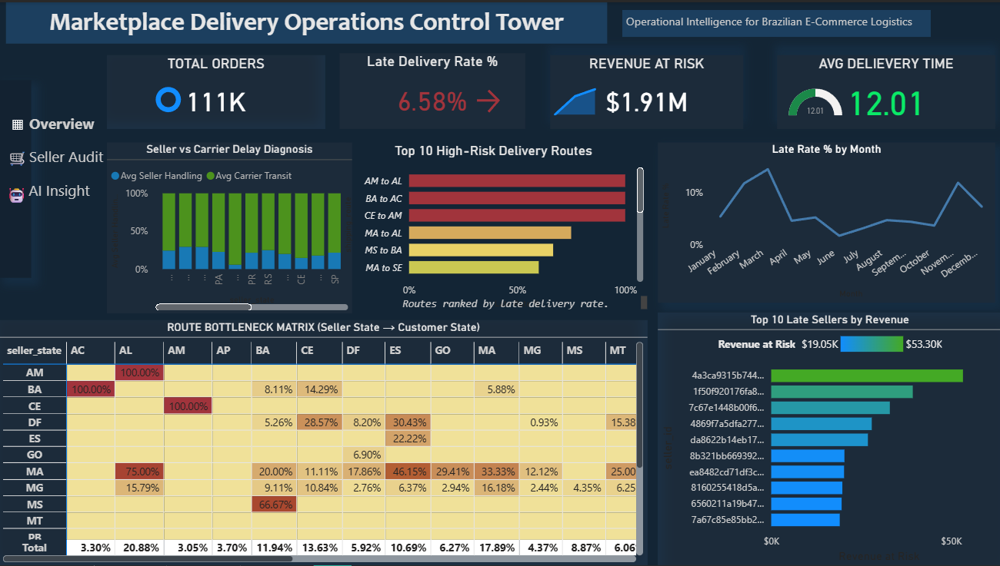
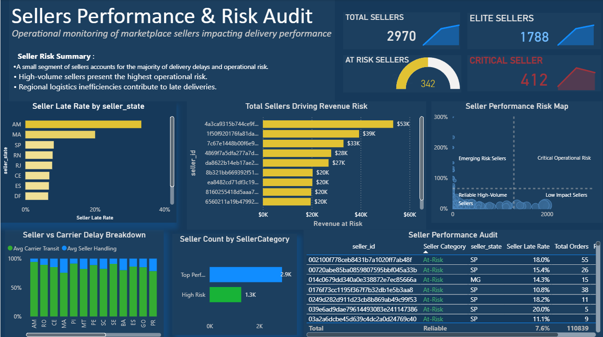
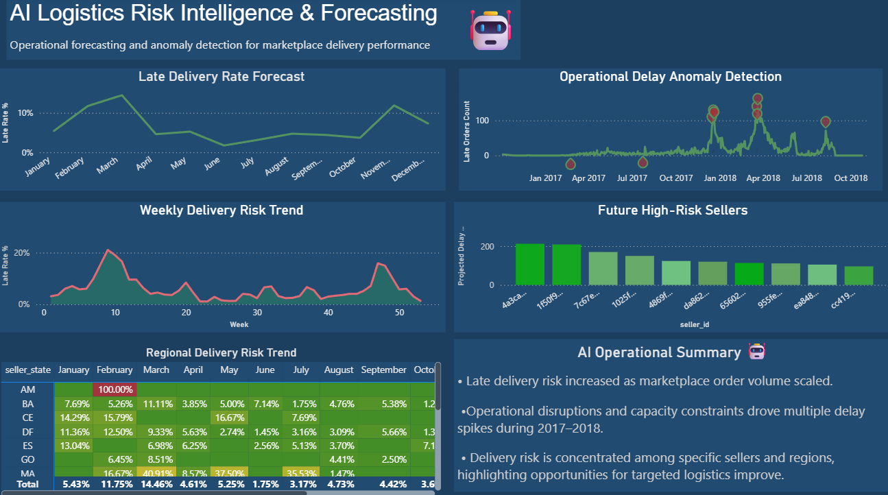

# 📦 Marketplace Logistics Intelligence Dashboard
### Operational Analytics for Brazilian E-Commerce Delivery Performance

<p align="left">
  
  
  
  
</p>

> An end-to-end operational analytics system built on the Brazilian Olist E-Commerce dataset — monitoring delivery performance, auditing seller risk, and surfacing predictive logistics insights through a three-page Power BI dashboard.

---

## 📊 Dashboard Preview

### 🗼 Operations Control Tower


### 👤 Seller Performance & Risk Audit


### 🤖 AI Logistics Risk Intelligence


---

## 🎯 Project Objective

Delivery delays are one of the most costly and visible problems in e-commerce marketplaces. This project transforms raw logistics data from the Olist marketplace into an operational intelligence system that answers:

- What is the current late delivery rate and how much revenue is at risk?
- Which sellers and routes are responsible for the most delays?
- Is the delay caused by the seller or the carrier?
- Which sellers are predicted to become high-risk?

---

## 📈 Key Metrics

| Metric | Value |
|---|---|
| Total Orders Analyzed | 111,000+ |
| Late Delivery Rate | 6.58% |
| Revenue at Risk | $1.91M |
| Avg Delivery Time | 12.01 days |
| Total Sellers | 2,970 |
| Critical Risk Sellers | 412 |

---

## 🔍 Key Insights

- **$1.91M in revenue** is at risk due to delivery delays across ~7,300 late orders
- **412 critical sellers** combine high order volume with high late rates — the most damaging segment
- Routes **AM→AL, BA→AC, CE→AM** approach 100% late delivery rates — structural infrastructure issues, not seller failures
- **Delay responsibility varies by region** — AM and MA delays are seller-driven; SP delays are carrier-driven
- **Delay spikes are predictable** — clustering around Q1 and peak sale periods, enabling proactive capacity planning

---

## 🛠️ Data Pipeline

```
Raw CSV Files  →  Cleaning & Validation  →  Feature Engineering  →  Analytical Dataset  →  Power BI Dashboard
```

**Feature Engineering Highlights:**

| Feature | Description |
|---|---|
| `is_late` | 1 if actual delivery > estimated delivery |
| `delay_days` | Days beyond estimated delivery date |
| `seller_handling_time` | Days from order approval to carrier pickup |
| `carrier_transit_time` | Days from carrier pickup to customer delivery |
| `seller_late_rate` | % of late orders per seller |
| `revenue_at_risk` | Order value for late/undelivered orders |

---

## 📁 Project Structure

```
ecommerce-logistics-intelligence-dashboard/
├── data/                  # Raw and processed datasets
├── Notebook/              # Jupyter notebooks (cleaning, EDA, feature engineering)
├── Dashboard/             # Power BI .pbix file
├── Images/                # Dashboard screenshots
├── docs/                  # Project case study documentation
├── scripts/               # Python ETL scripts
├── requirements.txt       # Python dependencies
└── README.md
```

---

## 🧰 Tools & Technologies

| Tool | Purpose |
|---|---|
| Python + Pandas | Data cleaning, merging, feature engineering |
| Jupyter Notebook | Analysis and documentation |
| Matplotlib / Seaborn | Exploratory data analysis |
| Power BI | Interactive operational dashboard |
| Git / GitHub | Version control and portfolio hosting |

---

## 📂 Dataset

**Brazilian E-Commerce Public Dataset by Olist**
- 📥 Source: [Kaggle](https://www.kaggle.com/datasets/olistbr/brazilian-ecommerce)
- 📋 License: CC BY-NC-SA 4.0
- 📦 Scale: 100K+ orders · ~3,000 sellers · 27 Brazilian states · 2016–2018

---

## 📄 Case Study

For a detailed walkthrough of the business problem, methodology, insights, and recommendations, see the full case study in [`docs/case_study.md`](docs/case_study.md)

---

*Built by [Manas Paliwal](https://github.com/Manaspaliwal18) · [LinkedIn](https://linkedin.com/in/manaspaliwal18)*
